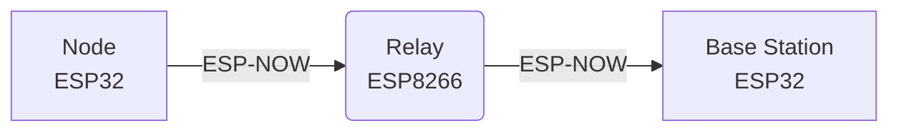

# ESP-NOW Mesh Communication System

A simple 3-node mesh network using ESP-NOW for emergency alerts. 

## Block Diagram

## How It Works
1. **Node (`node.ino`)**: Generates an emergency `MeshPacket` (e.g., "FIRE") and sends it to the Relay.
2. **Relay (`relay.ino`)**: Receives the raw packet bytes and blindly forwards them to the Base Station.
3. **Base Station (`base.ino`)**: Validates the packet size, reads the emergency details, and prints the alert to the Serial Monitor.

## Quick Setup
1. Flash `base/base.ino` to the first ESP32. Check the Serial Monitor (115200 baud) for its MAC address.
2. Put the Base's MAC address into `baseMAC` in `relay/relay.ino`. Flash this to the ESP8266. Check its MAC address.
3. Put the Relay's MAC address into `relayMAC` in `node/node.ino`. Flash this to the second ESP32.
4. Watch the Base Station's Serial Monitor to see incoming alerts!
