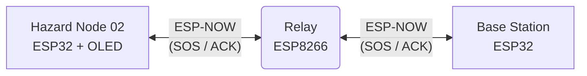

# ESP-NOW Mesh Communication System

A bidirectional 3-node mesh network using ESP-NOW for emergency alerts with Acknowledgment (ACK) and OLED display integration.

## Block Diagram

## Features
- **Bidirectional Communication**: Supports sending emergency packets to the Base Station and returning ACKs back to the Hazard Node.
- **Hop & TTL Tracking**: Packets contain Hop Counts and Time-to-Live (TTL) tracking to prevent infinite routing loops.
- **OLED Integration**: The Hazard Node is equipped with an I2C SSD1306 OLED display for visual status updates.
- **Robust Delivery**: The Hazard Node will retry sending the alert up to 5 times until an ACK is successfully received.

## How It Works
1. **Hazard Node (`node/node.ino`)**: Generates an emergency `MeshPacket` (Type 3: FIRE) and sends it to the Relay. Displays the current status on the OLED and waits for an ACK. Retries every 3 seconds if no ACK is received.
2. **Relay (`relay/relay.ino`)**: Operates in `COMBO` mode. Receives packets and inspects their type.
   - Forwards Type 1 & 3 (Emergencies) to the Base Station.
   - Forwards Type 2 (ACKs) back to the Hazard Node.
   - Increments Hop Count and decrements TTL.
3. **Base Station (`base/base.ino`)**: Receives the emergency packet, logs the alert to the Serial Monitor, and automatically constructs and sends a Type 2 ACK packet back through the Relay to confirm receipt.

## Quick Setup
1. **Hardware Dependencies**: The Hazard Node requires the `Adafruit_GFX` and `Adafruit_SSD1306` libraries installed in the Arduino IDE. Connect the OLED to pins SDA (25) and SCL (26).
2. **Flash the Boards**:
   - `base/base.ino` -> ESP32 (Base Station)
   - `relay/relay.ino` -> ESP8266 (Relay)
   - `node/node.ino` -> ESP32 (Hazard Node)
3. **Configure MAC Addresses**: Ensure `baseMAC` and `hazardMAC` are properly set in `relay.ino`, and `relayMAC` is set in `node.ino`. All devices operate on WiFi Channel 1.
