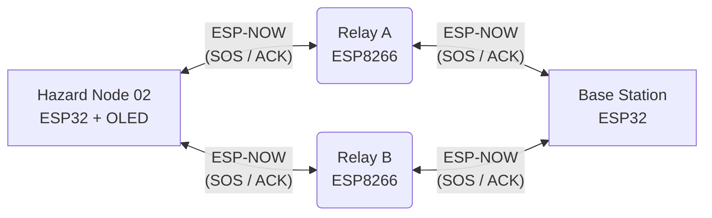

# Self-Healing ESP-NOW Mesh Communication System

A bidirectional, multi-path 4-node mesh network using ESP-NOW for emergency alerts with Acknowledgment (ACK) and OLED display integration. The system features dual relay paths (Relay A and Relay B) to ensure robust, self-healing communication between the Hazard Node and the Base Station.

## Block Diagram



## Features
- **Bidirectional Communication**: Supports sending emergency packets to the Base Station and returning ACKs back to the Hazard Node.
- **Self-Healing Dual Path**: Utilizes two independent relays (Relay A and Relay B). If one relay path fails, the other path ensures packet delivery. 
- **Hop & TTL Tracking**: Packets contain Hop Counts and Time-to-Live (TTL) tracking to prevent infinite routing loops.
- **Duplicate Protection**: The Base Station tracks message IDs to prevent duplicate alert generation from dual-path delivery.
- **OLED Integration**: The Hazard Node is equipped with an I2C SSD1306 OLED display for visual status updates.
- **Robust Delivery**: The Hazard Node attempts delivery via both relays simultaneously. If no ACK is received, it will retry sending the alert.

## How It Works
1. **Hazard Node (`hazard_node/hazard_node.ino`)**: Generates an emergency `MeshPacket` (Type 3: FIRE) and sends it simultaneously to Relay A and Relay B. Displays the current status on the OLED and waits for an ACK. Retries if no ACK is received within 5 seconds.
2. **Relays (`relay_a/relay_a.ino`, `relay_b/relay_b.ino`)**: Operate in `COMBO` mode. Receive packets and inspect their type.
   - Forwards Type 1 & 3 (Emergencies) to the Base Station.
   - Forwards Type 2 (ACKs) back to the Hazard Node.
   - Increments Hop Count and decrements TTL.
3. **Base Station (`base/base.ino`)**: Receives the emergency packet, logs the alert to the Serial Monitor, and handles duplicate protection using the `messageID`. It automatically constructs and sends a Type 2 ACK packet back through both Relay A and Relay B to confirm receipt.

## Directory Structure

```text
.
├── base/
│   └── base.ino           # ESP32 Base Station Node
├── hazard_node/
│   └── hazard_node.ino    # ESP32 Hazard Node with OLED
├── relay_a/
│   └── relay_a.ino        # ESP8266 Relay A Node
├── relay_b/
│   └── relay_b.ino        # ESP8266 Relay B Node
└── README.md
```

## Quick Setup
1. **Hardware Dependencies**: The Hazard Node requires the `Adafruit_GFX` and `Adafruit_SSD1306` libraries installed in the Arduino IDE. Connect the OLED to pins SDA (25) and SCL (26).
2. **Flash the Boards**:
   - `base/base.ino` -> ESP32 (Base Station)
   - `hazard_node/hazard_node.ino` -> ESP32 (Hazard Node)
   - `relay_a/relay_a.ino` -> ESP8266 (Relay A)
   - `relay_b/relay_b.ino` -> ESP8266 (Relay B)
3. **Configure MAC Addresses**: Ensure `baseMAC` and `hazardMAC` are properly set in both relay files, and `relayAMAC` and `relayBMAC` are set in both `base.ino` and `hazard_node.ino`. All devices operate on WiFi Channel 1.
